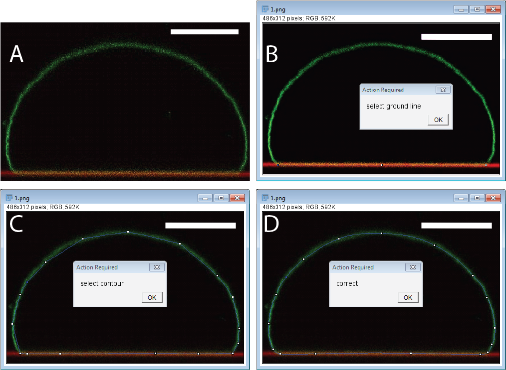

## Measuring adhesion energy from the shape of adhering vesicles

In contact with an adhesive substrate, vesicles with fluid membranes will deform to maximize the adhesion area. 
The balance between adhesion energy, membrane bending rigidity and vesicle volume and membrane area constrains determines the shape 
of the adhering vesicle. Thus measurements of the shape of an adhering vesicle can be used to approximate the 
membrane-substrate adhesion energy. Experimentally the method is based on fluorescence confocal imaging of adhering GUVs. Details of the method are given in the references (1,2) which should be read first. In the following the application and image analysis tools used are described. Basic knowledge of MATLAB and ImageJ is assumed. I used a semi-automated approach to extract the membrane contour instead of a completely automated contour detection. While latter might be preferred, the used approach turned out to be quite effective for a typical measurement of a few 10's of vesicles per condition.

Note: The imaging quality and resolution will determine the precision of the method and should be optimized first.
It is advantageous to use a high NA water Immersion objective to limit spherical aberrations and achieve high resolution.
Because the adhering vesicle shapes considered must have rotational symmetry, it is sufficient to acquire a side view of a adhering vesicle. This is conveniently done with the fast "Galvo z-stage" with allows to acquire a (x,z) image with a single confocal scan. As will become clear further below it is quite advantageous to overlay the image with the location of the adhesive substrate. This can be done elegantly by visualizing the light reflected form the water-substrate interface. On Leica SP microscopes this is accomplished using the "Reflection" presetting. Check for your specific microscope setup how to acquire such an image. This short manual assumes that you have acquired an image similar to the one shown in Fig. 1A.



Figure 1.Confocal image (side-view) of an adhering vesicle. Membrane (green) and substrate (red).

### Steps to measure adhesion energy ###
1. The first step is to load your image into ImageJ or Fiji and load the macro provided below. After downloading into the appropriate folder of your Imagej copy, you can find the macro using Plugin -> Macros in Imagej/Fiji.
2. After starting the macro will ask you to "select the ground line" (Fig. 1B). This line is used to determine the adhesion area and the extracted adhesion energy can be quite sensitive to the precise value of adhesion area. Thus be consistent as what to count as the adhesion zone. In the overlay image of substrate and membrane signal the overlap can determined quite well by eye as the yellow region, but you might consider to use a more quantitate approach for this measure. For example you could calculate the co-localization of the two channels. This should improve the scatter of the data greatly.
3. After clicking ok the macro selects the polygon tool which you use to roughly select the membrane contour as shown in Fig 1C.
4. In the next step a smooth spline is fitted through your points. Now is the time to correct the location of the points to accurately represent the membrane contour like shown in Fig 1D.
6. This will store the coordinates of the contour and adhesion disc in a file named after the image file. Note that also the original image file is overwritten with the contour overlayed. In the following the textfile with the coordinates is called ```1.txt```.
5. Now start MATLAB and make sure that you download ```getRV.m``` and ```tordeux_adhesive.m``` (links below) and all files are in the same path. Now you can calculate the area, volume and reduced volume from this contour. Call ```getRV3(data,scale)``` with the datafile and ```scale``` the pixelsize in units of µm.
```
>> data=importdata("1.txt");
>> [rv,avg,dev,discarea]=getRV3(data,7.2)
rv =
    0.8425    0.8424
avg =
   1.0e+04 *
    1.0164    8.1191    0.8425
dev =
   1.0e+03 *
    0.3614    4.3248    0.0001
discarea =
   2.7559e+03
```
6.  Each image is divided along the midpoint of the "ground line" selected in Fiji in Step 2. Thus for each image you get two values for vesicle area and volume. Here ```rv``` is the reduced volume, ```avg[1]``` is the average area (µm^2) from the two mirror images, ```avg[2]``` the corresponding vesicle volume and average reduced volume ```avg[3]```. As a rule of thumb the corresponding standard deviations in ```dev```should be a at least a factor of 10 smaller then the average values. ```discarea```is the total adhesion area calculated from the "Ground line". The adhesion energy is calculated from these values:
 ```
>> tordeux_adhesive(rv,avg,dev,discarea)
ans =
    0.4467
```
5. The result is the adhesion energy normalized by bending ridigity kappa in units of µm^(-2). I recommend to first obtain a series of images of the same vesicle and calculate the adhesion energies for this individual vesicle. This will give you a feeling for the quality of your images and extracting of area and volume.

## References
1.	Modulating Vesicle Adhesion by Electric Fields, J. Steinkühler, J. Agudo-Canalejo, R. Lipowsky, R. Dimova
_Biophysical Journal_ 111 (7), 1454-1464, 2016 
[Full Text](https://linkinghub.elsevier.com/retrieve/pii/S0006-3495(16)30751-2)
2. Analytical characterization of adhering vesicles, Tordeux, C., J-B. Fournier, and P. Galatola
_Physical Review E_ 65.4 041912, 2002
2. [getRV.m](adhesionenergy/getRV.m)
2. [tordeux_adhesive.m](adhesionenergy/tordeux_adhesive.m)
3. [ImageJ Macro](adhesionenergy/imagejcontour.ijm)

[Back](http://jansteinkuehler.github.io)
