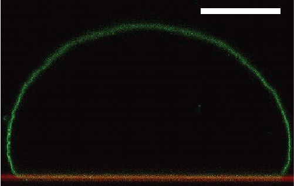

## Measuring membrane-substrate adhesion energy from images of adhering vesicles ##

In contact with an adhesive substrate, soft vesicles will deform to maximize the adhesion area. 
The balance between adhesion energy, membrane bending rigidity and the vesicle volume and surface constrains determines the shape 
of the adhering vesicle. Thus measurements of the shape of an adhering vesicle can be used to approximate the 
membrane-substrate adhesion energy which is usually not known. Experimentally the method is based on fluorescence confocal imaging of adhering GUVs. Details of the method are given in the references (1,2) which should be read first. In the following the application and image analysis tools used are described. 

Note: The imaging quality and resolution will determine the accuracy of the method and should be optimized first.
It is advantageous to use a high NA water Immersion objective to limit spherical aberrations and achieve high resolution.
Because the adhering vesicle shapes considered must be rotationally symmetric, it is sufficient to acquire a single side view of a adhering vesicle.
This is conveniently done with the fast Galvo z-stage with allows to acquire a (x,z) image with a single confocal scan.
As will become clear further below it is quite advantageous to overlay the image with the location of the adhesive substrate.
This can be done quite elegantly using the light reflected form the water-substrate interface.
This can be obtained quite easily on Leica SP microscopes using the "Reflection" presetting. 
Check for your specific microscope setup how to acquire such an image. This manual assumes that you have acquired an image simillar to the one shown in Figure 1A.

Figure 1.Confocal image (side-view) of an adhering vesicle. Membrane (green) and substrate (red).

1. The first step is to load your image into ImageJ or Fiji and load the macro provided below. After downloading you can find the open the macro using Plugin -> Macros in Imagej/Fiji.
2. After starting the macro will ask you to "select the ground line" (Fig 1B). This line is  used to determine the adhesion area and the extracted adhesion energy can be quite senstive to the precise value of adhesion area. Thus be consistent as what to count as the adhesion zone. In the overlay image of substrate and membrane signal the overlap can determind quite well by eye but you might consider to use a more quantivtive aproch for this measure. This should improve the scatter of the data greatly.
3. 
